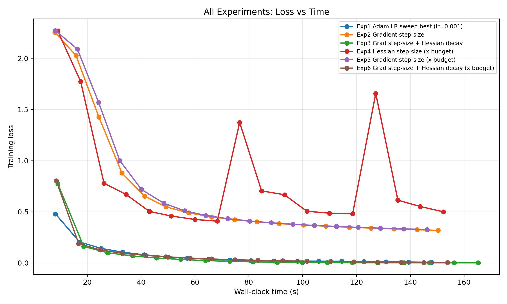
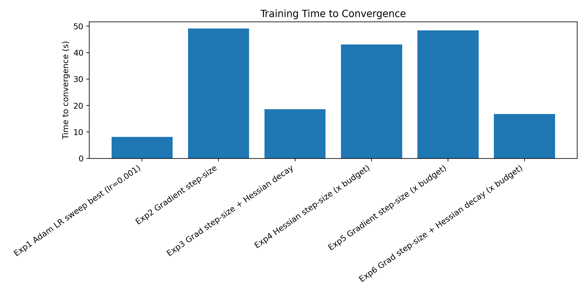

# Dedicated Step-Size Experiments on MNIST

This project tests whether assigning a dedicated step-size parameter to each neural network parameter can improve optimization performance (lower loss and/or faster convergence) versus a standard optimizer baseline.

All setups are compared on MNIST classification.  
Each setup starts from matched random initialization to ensure fair comparison.

## Experimental Setups

Let `X` be the number of neural-network parameters in the baseline model.

- Setup 1 (Baseline): Standard neural network with `X` parameters, trained with **Adam**. A learning-rate sweep is used to select the best baseline LR.
- Setup 2: Neural network with `X` parameters + `X` dedicated step-size parameters (`2X` total). Step-size parameters are updated from a Gradient-based signal.
- Setup 3: Neural network with `X` parameters + `X` dedicated step-size parameters + `X` step-size-decay parameters (`3X` total). Step-size updates use Gradients; decay updates use a Hessian-based signal.
- Setup 4: Parameter-budget-matched variant of Setup 2: neural network uses about `X/2`, and dedicated step-size parameters use about `X/2` (`~X` total). Step-size parameters are updated from a Hessian-based signal.
- Setup 5: Parameter-budget-matched variant of Setup 3: neural network uses about `X/2`, and dedicated step-size parameters use about `X/2` (`~X` total). Step-size parameters are updated from a Gradient-based signal.
- Setup 6: Parameter-budget-matched variant of Setup 4: neural network, step-size, and step-size-decay each use about `X/3` (`~X` total). Step-size updates use Gradients; decay updates use a Hessian-based signal.

## Results

In current runs, Setup 3 and Setup 6 can reach competitive training loss to the baseline, but the Adam baseline remains faster to converge in wall-clock time.

## Plots





## Run

```bash
python mnist_step_size_experiments.py --epochs 6 --batch-size 256 --subset-size 12000
```

### Device Requirement
CUDA is required by default.
If CUDA is unavailable, run:

```bash
python mnist_step_size_experiments.py --allow-cpu
```